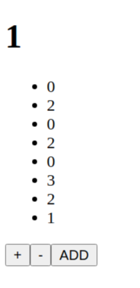

# Redux Counter App 
### Basic counter app.
- It has three button `increase`, `decrease` and `add`.
- When click on the `add` button, current number on the page(current counter state) adding to list(list state)
- It created with [duck pattern](https://github.com/erikras/ducks-modular-redux)
  

## Built With

- Javascript
- React
- Redux

## Live Demo

<!-- - [Math Magicians-Netlify](https://math-magicians-react.netlify.app/)
- [Math Magicians-Heroku](https://mathmagician-react-app.herokuapp.com/) -->

## Setup
- Clone this project
```
- $ git clone https://github.com/ahmetbozaci/redux-counter.git
- $ cd redux-counter
```
- Install npm packages
```
- $ npm install
```
- Open website
```
- $ npm start
```
## Authors

👤 **Ahmet Bozacı**
- Github:[ahmetbozaci](https://github.com/ahmetbozaci)
- Twitter:[ahmtbozaci](https://twitter.com/ahmtbozaci)
- LinkedIn:[ahmetbozaci](https://www.linkedin.com/in/ahmetbozaci/)
## 🤝 Contributing

Contributions, issues, and feature requests are welcome!

Feel free to check the [issues page](../../issues/).

## Show your support

Give a ⭐️ if you like this project!

## 📝 License

This project is [MIT](./LICENSE) licensed.